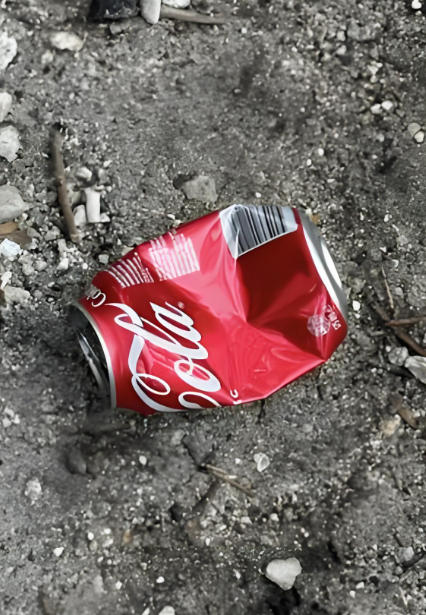
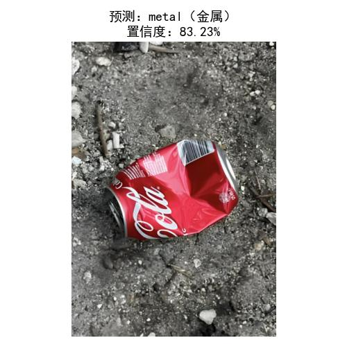

# 基于 MobileNetV2 的垃圾图像分类

## 项目简介 | Project Overview

本项目为深圳大学《人工智能》课程实验二，主要实现基于 **MobileNetV2** 的垃圾图像分类。本实验使用**MobileNetV2** 预训练模型进行迁移学习，在 CPU 环境下对垃圾分类图像数据集进行轻量化训练，实现对纸板、玻璃、金属、纸张、塑料和其他垃圾共 6 类图像的自动分类。

---

## 实验目标 | Objectives

- 掌握图像分类数据集的组织方式
- 学习使用 PyTorch 进行模型训练与推理
- 理解 MobileNetV2 迁移学习的基本流程
- 完成垃圾图像的分类预测与结果展示

---

## 数据集说明 | Dataset

本实验使用 Roboflow 上的公开垃圾分类数据集，数据集按类别文件夹组织，可直接通过 `torchvision.datasets.ImageFolder` 读取。

#### 数据集目录结构 | Dataset Structure

```
garbage-classification/
|-- cardboard/
|   # 纸板图片
|-- glass/
|   # 玻璃图片
|-- metal/
|   # 金属图片
|-- paper/
|   # 纸张图片
|-- plastic/
|   # 塑料图片
`-- trash/
    # 其他垃圾图片
```

---

## 工程结构 | Project Structure

```text
garbage-classification/
|-- train.py	# 模型训练脚本 
|-- predict.py	# 图片预测脚本 
|-- best_model.pth	# 训练得到的最佳模型权重
|-- garbage-classification/	# 垃圾分类图片数据集  
|-- images/	# 测试图片和预测结果图片
|-- 实验二-基于MobileNetV2 的垃圾图像分类.pdf
```

---

## 环境准备 | Environment Setup

实验使用 Anaconda 创建好的独立环境。

```bash
conda activate yolo11
pip install torch torchvision matplotlib pillow
```

---

## 模型训练 | Training

运行训练脚本：

```bash
python train.py
```

训练流程概括：

- 将图片统一缩放为 `128x128`
- 对训练集进行随机翻转和随机旋转增强
- 使用 ImageNet 预训练的 MobileNetV2
- 冻结特征提取层，只训练最后的分类头
- 按 8:2 划分训练集和验证集
- 保存验证集准确率最高的权重到 `best_model.pth`

---

## 核心结论 | Result

#### 示例测试结果 | Example

| 测试图片 | 预测结果 |
| --- | --- |
|  |  |

以cpu训练15轮的数据为例：

| Epoch | Loss | Train Acc | Val Acc |
| :--: | :--: | :--: | :--: |
| 1 | 1.199 | 0.545 | 0.638 |
| 3 | 0.779 | 0.722 | 0.685 |
| 5 | 0.772 | 0.716 | 0.735 |
| 8 | 0.698 | 0.743 | 0.739 |
| 11 | 0.684 | 0.752 | 0.745 |

- 模型在训练过程中整体表现稳定，Loss由**1.199**逐步下降至 **0.684**，说明模型的预测结果与真实标签之间的差距不断减小；
- 同时，训练集准确率 和验证集准确率均呈上升趋势，最终验证集准确率达到**0.745**，表明模型具备一定的 分类能力和泛化能力。
- 但从结果也可以看出，模型仍存在进一步优化空间，后续可通过增加训练轮数、调整学习率、优化网络结构或扩充数据集等方式提升模型性能。

---

## 后续改进方向 | Future Work

- 增加训练轮数以提升分类准确率
- 使用 GPU 加快训练速度
- 尝试解冻部分特征层进行微调
- 增加更多复杂场景下的垃圾图片，提高模型泛化能力
